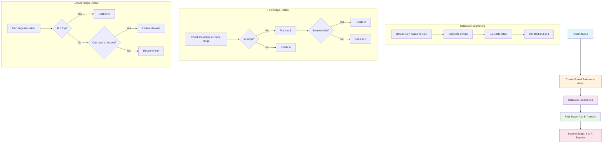

# Push Swap

## a7ssn push swap f 1337 w diima haamza

A sorting algorithm project that sorts data on a stack using a limited set of operations and the minimum number of moves.

## Table of Contents
- [Description](#description)
- [Installation](#installation)
- [Usage](#usage)
- [Algorithm Overview](#algorithm-overview)
- [Flow Diagram](#flow-diagram)
- [Detailed Algorithm Explanation](#detailed-algorithm-explanation)
- [Operations](#operations)
- [Project Structure](#project-structure)
- [Testing](#testing)
- [Performance](#performance)
- [Contributing](#contributing)

## Description

Push Swap is a 42 School project that challenges students to sort a stack of integers using only specific operations. The goal is to sort the stack with the minimum number of moves possible.

### Objectives
- Sort a stack of random integers
- Use only predefined operations
- Minimize the number of operations
- Handle edge cases and error management

## Installation

```bash
# Clone the repository
git clone https://github.com/yourusername/push_swap.git
cd push_swap

# Compile the project
make

# This will create the push_swap executable
```

## Usage

```bash
# Basic usage
./push_swap 3 2 1 6 5 8

# With negative numbers
./push_swap -1 -3 0 1 2

# Using quotes (single argument)
./push_swap "3 2 1 6 5 8"

# Check with checker (if available)
./push_swap 3 2 1 6 5 8 | ./checker 3 2 1 6 5 8
```

### Error Handling
The program handles various error cases:
- Non-integer arguments
- Duplicate numbers
- Numbers outside integer range
- Empty arguments

## Algorithm Overview

The push_swap algorithm uses a chunk-based approach that divides the numbers into manageable segments and processes them in two main stages:

### Strategy Selection
- **3 numbers or less**: Direct sorting
- **4-5 numbers**: Optimized small sort
- **6+ numbers**: Chunk-based algorithm with adaptive parameters

### Key Concepts
1. **Stack A**: Initial stack containing unsorted integers
2. **Stack B**: Helper stack for temporary storage
3. **Reference Array**: Sorted copy of input for position tracking
4. **Chunk Processing**: Dividing numbers into ranges for efficient sorting

## Flow Diagram



## Detailed Algorithm Explanation

### Initial Setup

1. **Input Processing**: Take all numbers and place them in Stack A
2. **Reference Array Creation**: Create a sorted copy of the input array
3. **Parameter Calculation**:
   - `n`: Chunk size parameter
     - 5 for ≤10 numbers
     - 8 for ≤150 numbers  
     - 18 for >150 numbers
   - `middle = stack_size / 2`
   - `offset = stack_size / n`
   - `start = middle - offset`
   - `end = middle + offset`

### Example Walkthrough

**Input**: `[7, 2, 1, 5, 4, 3, 6]`
**Sorted Reference**: `[1, 2, 3, 4, 5, 6, 7]`
**Parameters**: 
- Stack size: 7
- n: 5 (since ≤10 numbers)
- middle: 3
- offset: 1
- start: 2, end: 4

### First Stage: A to B Transfer

The algorithm processes numbers in chunks, transferring them from Stack A to Stack B:

```
Initial chunk range: positions 2-4 in sorted array (numbers 3, 4, 5)

For each number in Stack A:
1. Check if its position in sorted array is within [start, end]
2. If YES:
   - Push to Stack B (pb)
   - If number < middle value: Rotate B (rb)
   - Expand chunk range for next iteration
3. If NO:
   - Rotate Stack A (ra) to find next valid number
```

**Chunk Processing Example**:
- Chunk 1: Look for positions 2-4 (numbers 3, 4, 5)
- Chunk 2: Expand to positions 1-5 (numbers 2, 3, 4, 5, 6)
- Continue until all numbers are in Stack B

### Second Stage: B to A Transfer

Transfer numbers back from Stack B to Stack A in descending order:

```
While Stack B is not empty:
1. Find the largest number in Stack B
2. If it's at the top: Push to A (pa)
3. If not at top:
   - Check if rotating from bottom is more efficient
   - Use ra/rra to position the number at top
   - Push to A (pa)
```

### Algorithm Complexity

- **Time Complexity**: O(n²) worst case, O(n log n) average
- **Space Complexity**: O(n) for stacks and reference array
- **Operation Count**: Optimized for minimal moves

## Operations

| Operation | Description | Effect |
|-----------|-------------|---------|
| `sa` | Swap A | Swap first 2 elements of stack A |
| `sb` | Swap B | Swap first 2 elements of stack B |
| `ss` | Swap both | Execute `sa` and `sb` |
| `pa` | Push A | Move top of B to top of A |
| `pb` | Push B | Move top of A to top of B |
| `ra` | Rotate A | Move top of A to bottom |
| `rb` | Rotate B | Move top of B to bottom |
| `rr` | Rotate both | Execute `ra` and `rb` |
| `rra` | Reverse Rotate A | Move bottom of A to top |
| `rrb` | Reverse Rotate B | Move bottom of B to top |
| `rrr` | Reverse Rotate both | Execute `rra` and `rrb` |

## Project Structure

```
push_swap/
├── src/
│   ├── push_swap.c          # Main program
│   ├── parsing.c            # Input validation and parsing
│   ├── operations.c         # Stack operations implementation
│   ├── sort_small.c         # Small stack sorting algorithms
│   ├── sort_large.c         # Large stack chunk-based algorithm
│   ├── utils.c              # Utility functions
│   ├── position_utils.c     # Position calculation helpers
│   └── error_handling.c     # Error management
├── includes/
│   └── push_swap.h          # Header file
├── libft/                   # Custom C library (if used)
├── Makefile                 # Build configuration
└── README.md                # This file
```

## Testing

### Manual Testing
```bash
# Test with the example
./push_swap 7 2 1 5 4 3 6

# Test with small numbers
./push_swap 3 2 1

# Test with larger sets
./push_swap 5 4 3 2 1 0 -1 -2

# Test error cases
./push_swap 1 2 2  # Duplicate
./push_swap abc    # Non-integer
```

### Automated Testing
```bash
# Random number generation for testing
ARG=$(seq 1 100 | shuf); ./push_swap $ARG | wc -l

# Test with checker
ARG=$(seq 1 100 | shuf); ./push_swap $ARG | ./checker $ARG

# Performance test
for i in {1..10}; do ARG=$(seq 1 100 | shuf); ./push_swap $ARG | wc -l; done
```

### Performance Benchmarks
- **3 numbers**: ≤ 3 operations
- **5 numbers**: ≤ 12 operations
- **100 numbers**: ≤ 700 operations
- **500 numbers**: ≤ 5500 operations

## Performance

### Optimization Techniques
1. **Chunk-based processing**: Divides problem into manageable segments
2. **Adaptive parameters**: Adjusts chunk size based on input size
3. **Position tracking**: Uses sorted reference array for efficient lookups
4. **Rotation optimization**: Chooses shortest path (top or bottom)
5. **Two-stage approach**: Separates distribution and collection phases

### Algorithm Advantages
- **Predictable performance**: Consistent behavior across different inputs
- **Scalable**: Handles both small and large datasets efficiently
- **Memory efficient**: Linear space complexity
- **Minimal operations**: Optimized for move count reduction

## Contributing

1. Fork the repository
2. Create a feature branch (`git checkout -b feature/improvement`)
3. Commit your changes (`git commit -am 'Add improvement'`)
4. Push to the branch (`git push origin feature/improvement`)
5. Create a Pull Request

## License

This project is part of the 42 School curriculum. Please respect the academic integrity policies of your institution.

---

**Note**: This project is for educational purposes. The implementation should be your own work if you're a 42 student.
